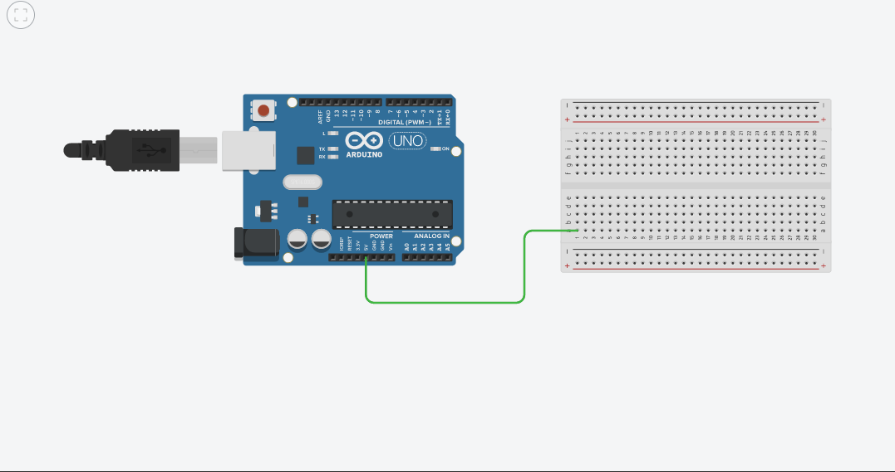
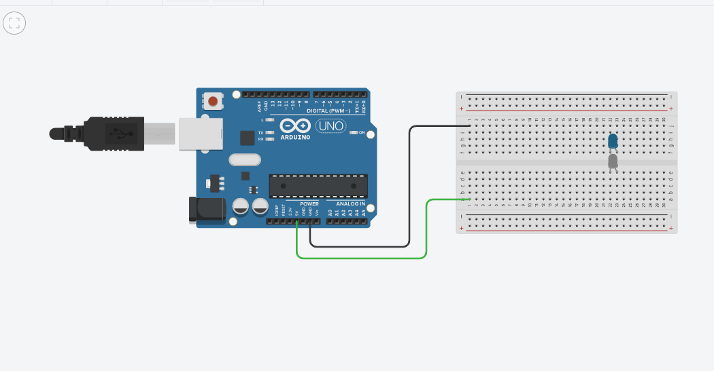
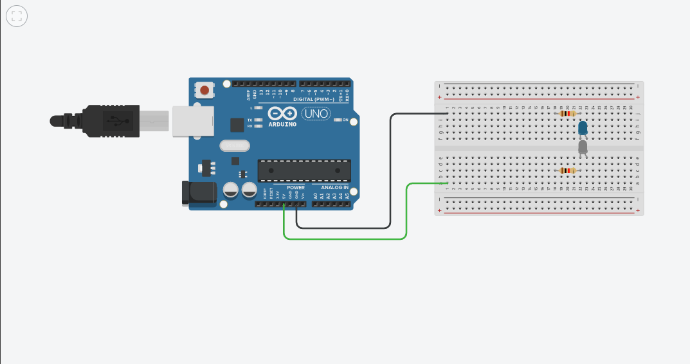
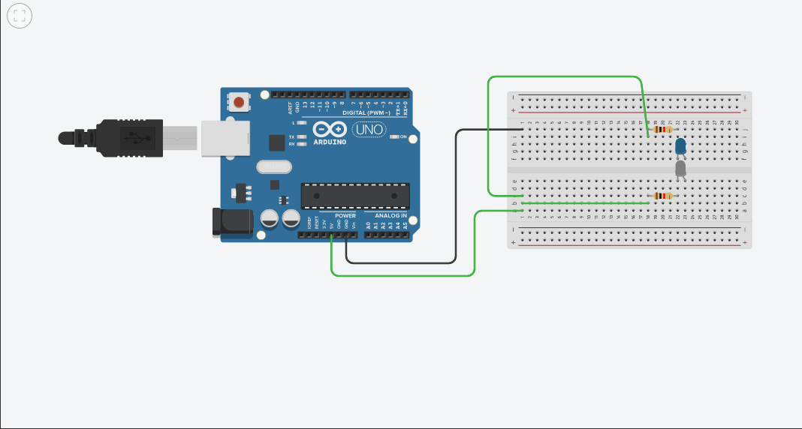
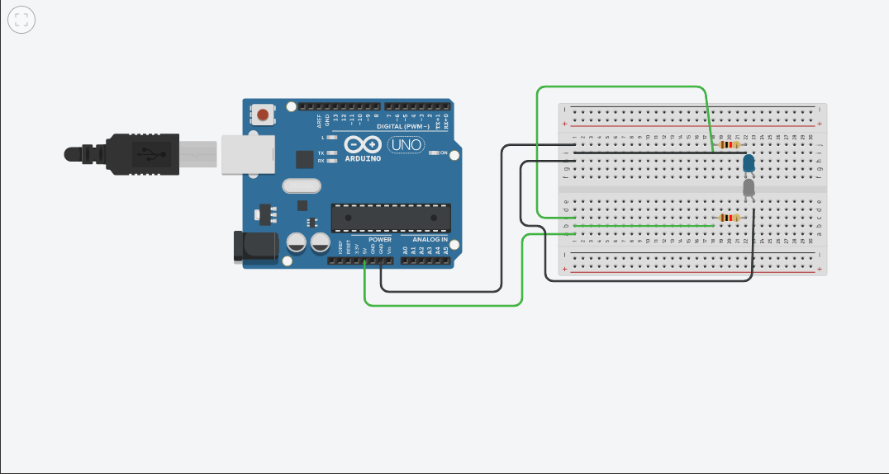
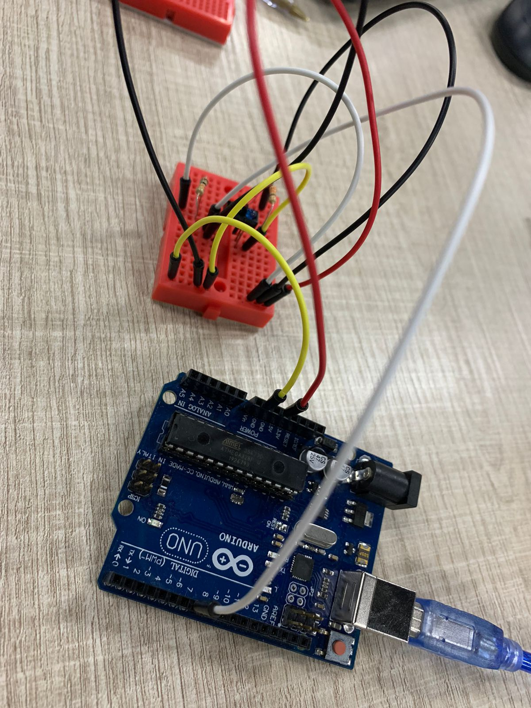
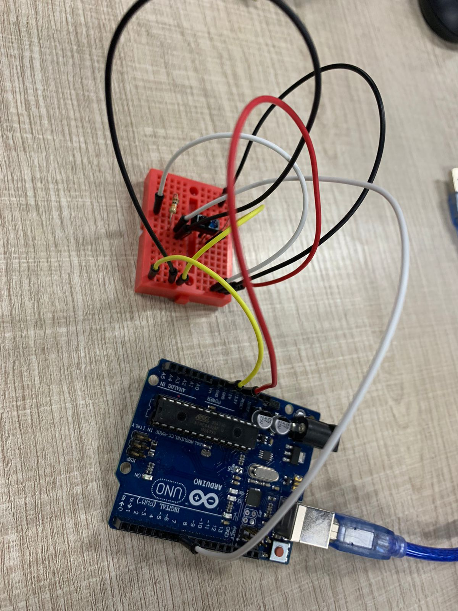
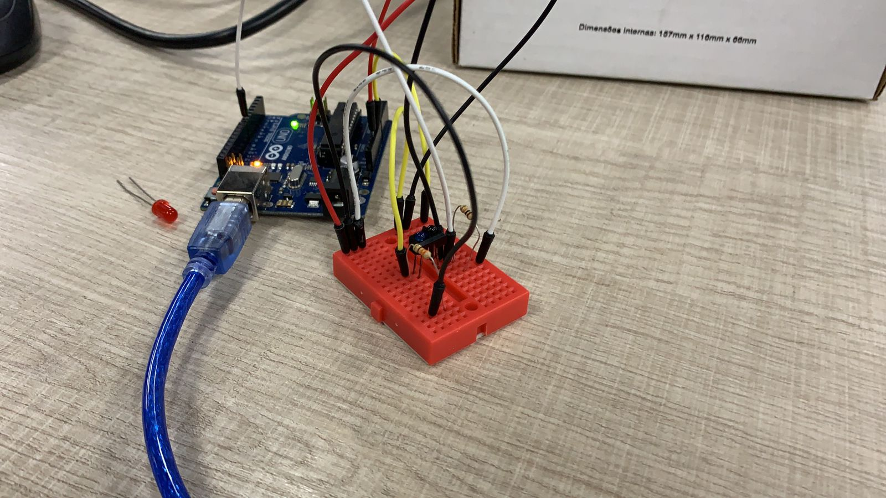
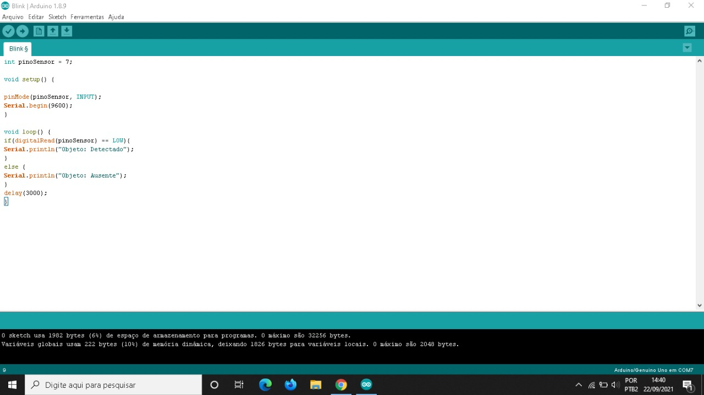

# MANUAL DE INSTALAÇÃO E USO
## ARDUINO UNO E SENSOR TCRT5000

---

1. Com um Arduino Uno, conecte um fio no pino de 5v e outro em uma fileira da protoboard:

2. Conecte da mesma maneira o fio ground, preferencialmente do lado oposto:

3. Coloque o sensor na protoboard, aqui representado por dois leds, um azul e outro branco:

4. Adicione dois resistores juntos ao na direção de uma das "pernas" do sensor:

5. Conecte fios de energia nas duas "pernas" dos resistores que estão mais afastadas do sensor:

6. Conecte dois fios pretos ground nas laterais dos sensores:

7. Conecte o fio do sensor na porta 7 e no socket entre o sensor preto (no caso branco) e o resistor:

---

## Segue demais imagens de fotos para melhor comprensão:

---

## Código e execução:

Em seguida execute o código a seguir dentro da IDE do arduíno.

~~~c++
int pinoSensor = 7;

void setup() {

pinMode(pinoSensor, INPUT);
Serial.begin(9600);
}

void loop() {
if(digitalRead(pinoSensor) == LOW){
Serial.println("Objeto: Detectado");
}
else {
Serial.println("Objeto: Ausente");
}
delay(3000);
}
~~~

